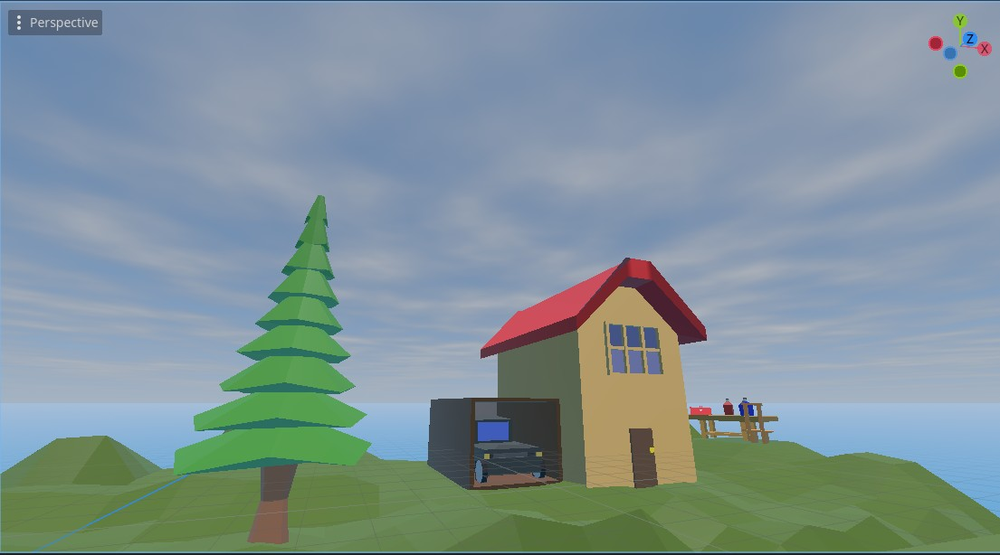
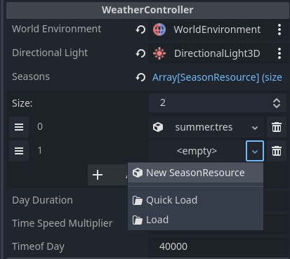
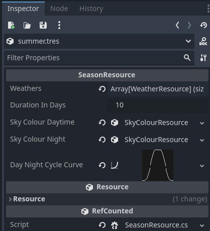
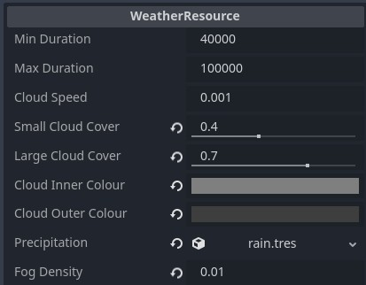

# Godot Weather System

A customisable season/weather system for Godot, made in C#.

**Features:**
- Day-night cycles
- Weather settings:
  - Clouds (coverage, colour)
  - Rain (precipitation)
  - Fog
- Season settings
  - Adjust day/night length with curve
  - Specify different types of weather for each season

## How to use

Quick start:
1. Open the [sample scene](sample_scene/sample_scene.tscn) in Godot
2. Adjust the settings on the "WeatherController" object to your liking
3. Click play

To use it in your own project you can either:
A. Copy the "WeatherController" object from the sample scene over to your own scene
or
B. Set up the weather related nodes yourself:
1. Copy [world_environment.tscn](addons/GodotWeatherSystem/nodes/world_environment.tscn) to your scene (you need to use this one, since it's using a custom shader)
2. Add a directional light
3. Add a WeatherController node (available through the "add node" menu after building with MSBuild)
4. In the WeatherController's inspector, link your directional light and world environment

### Season settings (SeasonResource)

The first thing you want to do is to create some seaons.
These controll what types of weather you will see (summer => clear sky, autumn => rain, etc.), and how long the nights are.

You can create a season settings either by adding a new entry to the WeatherController's weather list and clicking "New SeasonResource", or by right clicking anywhere in Godot's file system and clicking "new resource", and then choose "SeasonResource".

**Settings:**
- Weathers: List of available weathers (WeatherResource) for this season
- Duration in days: How many days the season lasts
- Sky colour daytime: How the sky looks at day time (SkyColourResource)
- Sky colour night: How the sky looks at night (SkyColourResource)
- Day night cycle curve: Curve that maps daytime (X axis starting at 00:00) to sky brightness. Allows you to make days longer during summer, and nights longer during winter

### Weather settings (WeatherResource)

The WeatherResource allows you to set up weather types, such as clear sky, clouded, foggy, rain, storm, etc.

Note: There are currently two types of clouds: "small" and "large clouds, and they have each their intensity/coverage settings.

**Settings:**
- Min duration: Minimum duration of season, in seconds (duration will be random, between set min/max values)
- Max duration: Maximum duration of season, in seconds (duration will be random, between set min/max values)
- Cloud speed: How fast the clouds moves
- Small cloud cover: How much "small" clouds there are (these look almost like a mackerel sky)
- Cloud cloud cover: How much "large" clouds there are (these clouds are thicker - you may want to use them for rainy weather and thunder storms)
- Percipitation: A reference to a PercipitationResource, that has settings for rain and other types of percipitation. There is a default [rain.tres](addons/GodotWeatherSystem/precipitation/rain.tres) that you can use out of the box.
- Fog density: Volumetric fog (you may want this on rainy days)

### Percipitation / rain (PercipitationResource)

These contain a reference to a particle system (scene), and an "amount ratio", that sets the intensity of the effect (how many particles - how much rain).

You can create your own particle effects. There's also a default [rain_particles.tscn][rain.tres](addons/GodotWeatherSystem/particles/rain_particles.tscn) that you can use.
